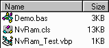



## Non\-Volatile RAM \(using disk files\)

### Description

Conceptually, non-volatile RAM is any RAM (random access memory) that is not lost because the memory device loses (external) power. The NvRam class implements this in a primitive but powerful way: by writing to and reading from a data file in real time. In principle, your code need only identify the location in this "memory" (as in an array) that a given variable is stored in and the class does the rest.

Here's a simple example of how it works:

 &nbsp;&nbsp;&nbsp;&nbsp;Dim MyVar As Long

 &nbsp;&nbsp;&nbsp;&nbsp;Set Nvr = New NvRam

 &nbsp;&nbsp;&nbsp;&nbsp;Nvr.Connect "C:\MyData.dat"

&nbsp;&nbsp;&nbsp;&nbsp;'Read in value,

 &nbsp;&nbsp;&nbsp;&nbsp;'do something with it,

 &nbsp;&nbsp;&nbsp;&nbsp;'and write it back out.

&nbsp;&nbsp;&nbsp;&nbsp;Nvr.ReadVar MyVar, 20

 &nbsp;&nbsp;&nbsp;&nbsp;MyVar = MyVar + 1

 &nbsp;&nbsp;&nbsp;&nbsp;Nvr.WriteVar MyVar, 20

  &nbsp;&nbsp;&nbsp;&nbsp;Nvr.Disconnect

  Here are some good applications for this class:

- Protecting in-"memory" data from power failures.

 - Maintaining large amounts of data with almost no memory overhead.

 - Maintaining program state across run-time sessions.

 - Sharing data among multiple processes.

While it does not yet have built-in support for storing user-defined data types or objects, all primitive data types (e.g., Long and String)

are supported. (Variants are allowed, so long as they are late-bound to one of the primitive data types.) Also missing is a way to shrink the size of the data file, the equivalent of ReDim Preserve. Feel free to make suggestions or add support for such features, so long as credit is given for the original code.

While tested with VB6/NT4, this should be compatible with any version of Windows that supports the CopyMemory() API call and which has data types with the same sizes as with Win32 systems like NT. Your comments and vote are welcome.
 
### More Info
 

             |
---                |---
**Submitted On**   |2000-06-12 17:17:58
**By**             |[James Vincent Carnicelli](https://github.com/Planet-Source-Code/PSCIndex/blob/master/ByAuthor/james-vincent-carnicelli.md)
**Level**          |Advanced
**User Rating**    |5.0 (25 globes from 5 users)
**Compatibility**  |VB 4\.0 \(32\-bit\), VB 5\.0, VB 6\.0
**Category**       |[Data Structures](https://github.com/Planet-Source-Code/PSCIndex/blob/master/ByCategory/data-structures__1-33.md)
**World**          |[Visual Basic](https://github.com/Planet-Source-Code/PSCIndex/blob/master/ByWorld/visual-basic.md)
**Archive File**   |[CODE\_UPLOAD67166122000\.zip](https://github.com/Planet-Source-Code/james-vincent-carnicelli-non-volatile-ram-using-disk-files__1-8872/archive/master.zip)

